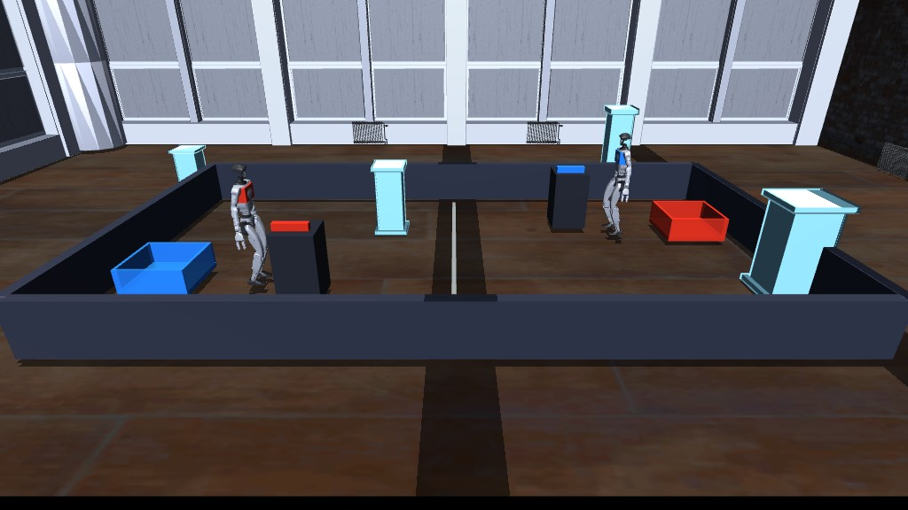
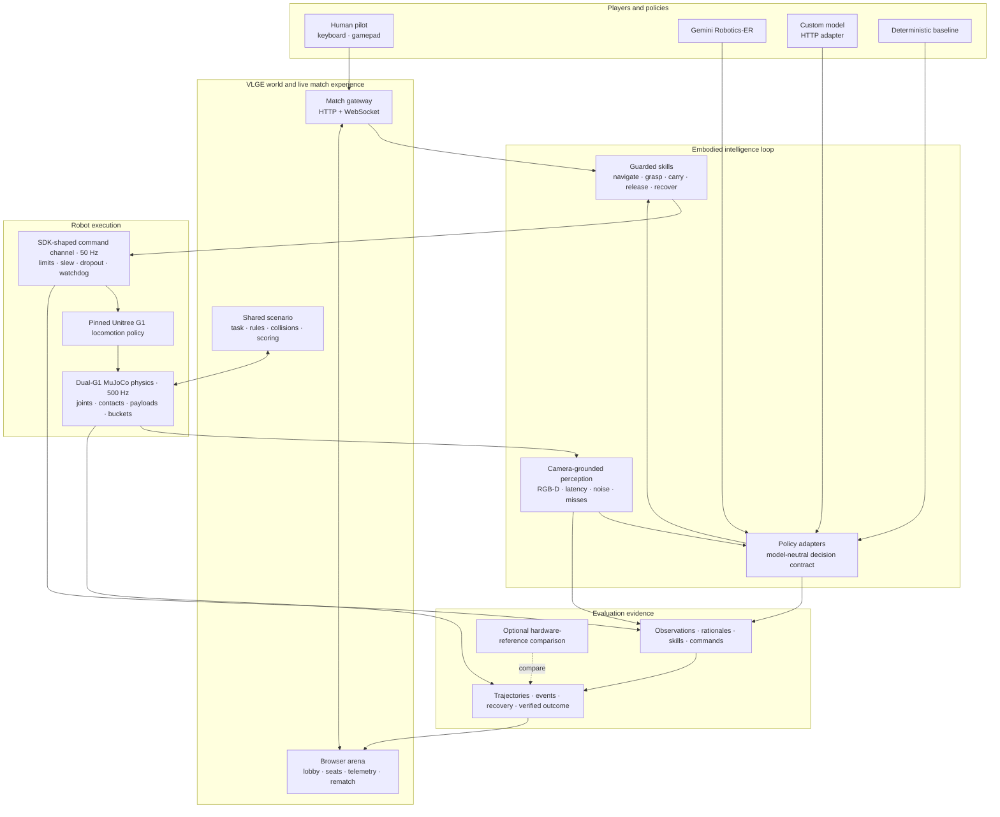

# Robot Gym

<p align="center">
  <strong>The competitive arena for embodied AI.</strong>
</p>

<p align="center">
  Put humanoid robot policies—and human pilots—inside the same physical task.<br />
  Race them live. Measure every decision. Turn failures into evaluation data.
</p>

<p align="center">
  <a href="https://gx5ye22m6jinyh-8085.proxy.runpod.net">
    
  </a>
  <a href="#run-it-yourself">
    
  </a>
  <a href="#architecture">
    
  </a>
</p>

<p align="center">
  <a href="https://gx5ye22m6jinyh-8085.proxy.runpod.net">
    
  </a>
</p>

<p align="center">
  <a href="https://gx5ye22m6jinyh-8085.proxy.runpod.net"><strong>Launch the live arena →</strong></a>
</p>

## What is Robot Gym?

Robot Gym is a live evaluation platform for physical intelligence.

Two simulated [Unitree G1](https://www.unitree.com/g1/) humanoids enter the
same shared world. Each must perceive a payload, navigate to it, grasp it,
cross the arena, and deliver it into a physical bucket. The first verified
delivery wins.

Choose who controls each robot:

| Match | What it tests |
|---|---|
| **AI vs AI** | Compare models under identical embodiment and physics |
| **Human vs AI** | Benchmark autonomy against an intuitive human baseline |
| **Human vs Human** | Test the task, controls, environment, and competitive format |

The match is the interface. The real product is the evidence generated beneath
it: camera observations, model decisions, commands, trajectories, failures,
recoveries, and verified outcomes.

> **Why competition?** A race makes robotic capability understandable at a
> glance while forcing policies to perform closed-loop, under uncertainty,
> without hiding retries behind a polished demo reel.

## Try it now

### [Open the live Robot Gym arena](https://gx5ye22m6jinyh-8085.proxy.runpod.net)

No installation is required to view or play a hosted match.

1. Choose **AI vs AI**, **AI vs Human**, or **Human vs Human**.
2. For an AI seat, optionally provide a temporary Gemini API key.
3. For a human seat, click the arena and use a keyboard or connected gamepad.
4. Deliver the payload into your bucket before the opponent.
5. Inspect the result and rematch.

The temporary API-key field is memory-only: the key is sent once to the match
process, cleared from the UI, and excluded from URLs, browser storage, evidence,
and repository files.

### Controls

| Action | Keyboard | Gamepad |
|---|---|---|
| Move | Arrow keys | Left stick or D-pad |
| Turn | `Q` / `E` | Right stick |
| Stop | `Space` | Center sticks |
| Grasp | `G` | A / Cross |
| Carry | `C` | X / Square |
| Release | `R` | B / Circle |
| Recover | `U` | Y / Triangle |
| Reset payload | `X` | Start / Options |
| Reset camera | `Home` | View / Back |

## Why it is different

Most robotics simulators answer: *can the controller move the robot?*

Robot Gym asks a harder, product-level question: *can this intelligence finish
the task reliably, faster than another intelligence, using only the information
and actions it would actually receive?*

- **Model-neutral competition** — Gemini Robotics-ER, deterministic baselines,
  custom HTTP policies, or human operators.
- **Shared physical world** — two articulated G1 humanoids, payloads, obstacles,
  checkpoints, and collision-enabled buckets in one MuJoCo simulation.
- **Camera-grounded decisions** — delayed RGB-D-derived estimates with misses,
  noise, confidence, and map fallback.
- **Hardware-shaped execution** — a 50 Hz SDK-style velocity channel with
  clipping, slew limits, latency, dropout, and watchdog stops.
- **Official locomotion policy** — the pinned Unitree G1 policy produces leg
  actions; language and vision models select grounded task-level skills.
- **Failure-aware manipulation** — grasp, carry, release, payload recovery,
  contact loss, and reset penalties are explicit match events.
- **Evidence, not anecdotes** — every run writes state, trajectory, event,
  perception, command-channel, and outcome artifacts.
- **Playable anywhere** — native MuJoCo on macOS or a headless GPU host with
  browser spectators, keyboards, and locally connected gamepads.

## Architecture



### The key boundary

Foundation models do **not** directly command joint torques. They choose
grounded intent through a compact skill contract. Guardrails, the command
channel, the Unitree locomotion policy, and MuJoCo own executable motion.

This separation makes cross-model comparisons meaningful and keeps a path open
for real SDK integration without presenting simulation as hardware
certification.

### Runtime sequence

```text
camera frame
  → delayed/noisy grounded observation
  → model or human decision
  → guarded task skill
  → bounded SDK-style velocity command
  → Unitree locomotion policy
  → MuJoCo physics and contact
  → scoring + evidence + live browser telemetry
```

## What a match produces

Each run can emit:

```text
outputs/<match>/
├── result.json
├── match_state.json
├── events.json
├── trajectory.json
├── sim_to_real_report.json
├── scene.xml
├── p1_sdk_command_trace.json
└── p2_sdk_command_trace.json
```

The public match state intentionally removes privileged ground-truth poses.
Evaluation-only diagnostics remain labeled separately.

## Run it yourself

### RunPod — fastest hosted setup

Use a GPU Pod with at least 64 GB system RAM, 40 GB container storage, and
HTTP ports `8085` and `8765` exposed.

```bash
cd /workspace
git clone https://github.com/KaushikSiva/robot-gym.git
cd robot-gym
bash scripts/setup_runpod.sh
scripts/run_g1_demo_5_runpod.sh lobby
```

Open the printed `https://<POD_ID>-8085.proxy.runpod.net` URL. Gamepads remain
connected to each player's browser; USB passthrough to the Pod is unnecessary.

The setup script creates an isolated Python environment, installs the EGL
runtime, downloads hash-checked robot assets and the pinned locomotion policy,
then renders a validation frame.

### macOS — native MuJoCo viewer

```bash
make mac-setup

scripts/run_g1_demo_5.sh match \
  --p1 human --p1-input gamepad --p1-gamepad 0 \
  --p2 human --p2-input idle
```

For the faster arcade locomotion profile:

```bash
scripts/run_g1_demo_6.sh match \
  --p1 human --p1-input idle \
  --p2 human --p2-input gamepad --p2-gamepad 0
```

The arcade profile triples planar command ceilings for gameplay. It is
explicitly labeled simulation-only and is not evidence of a safe real-G1
operating envelope.

### Validate without playing

```bash
scripts/run_g1_demo_5.sh validate
scripts/run_g1_demo_6.sh validate
```

### Run the test suite

```bash
python3 -m pytest tests -m "not integration"
```

## Bring your own model

Robot Gym exposes a small policy decision surface rather than coupling the
arena to one provider.

Built-in adapters:

- `gemini-er` — Gemini Robotics-ER;
- `scripted` — deterministic local validation policy;
- `http` — custom remote model endpoint.

```bash
scripts/run_g1_demo_5.sh match \
  --p1 policy --p1-adapter http --p1-endpoint http://127.0.0.1:9001/decide \
  --p2 policy --p2-adapter gemini-er
```

A policy selects grounded skills such as `navigate_object`, `grasp`,
`navigate_goal`, `release`, `recover`, and `wait`. The arena validates the
decision against the current physical state before execution.

## Sim-to-real stance

Robot Gym models several real control constraints, but a successful simulated
match is **not** proof of safe deployment on a physical G1.

The current evaluation boundary includes:

- the same `set_velocity(vx, vy, yaw_rate, duration)` transport contract used by
  the SDK-facing layer;
- command rate, latency, dropout, clipping, slew, and watchdog behavior;
- camera and joint noise, actuator-strength variation, friction randomization,
  and perception misses;
- optional comparison against recorded G1 SDK telemetry.

Assisted grasp modes are deliberately disclosed as privileged gameplay
features. Use contact-only manipulation when evaluating mechanical grasp
claims.

## Project map

```text
demo_3/        competitive dual-G1 arena, policies, browser client
demo_5/        perception, constrained command channel, evidence, hosted lobby
demo_6/        optional 3× planar-speed gameplay profile
demo_2/        SDK2 transport and real-G1 boundary experiments
pathvla/       VLA, MuJoCo sorting, OSM world generation, remote worker
isaac_ext/     Isaac Lab / Isaac Sim extension
scripts/       setup, launch, conversion, validation, and deployment tools
tests/         arena, policy, controls, recovery, deployment, and evidence tests
docker/        local and RunPod container definitions
```

## Roadmap

- [x] AI vs AI, human vs AI, and two-human live matches
- [x] Browser keyboard and gamepad control
- [x] Gemini, scripted, and custom HTTP policy adapters
- [x] Camera-grounded observations and hardware-shaped command transport
- [x] Evidence packages, recovery, rematch, and RunPod deployment
- [ ] Public benchmark seasons and verified leaderboards
- [ ] User-authored VLGE scenarios and task packs
- [ ] Additional humanoid embodiments and policy runtimes
- [ ] Hardware-partner validation on physical G1 units

## Investor brief

An editable investor deck and presenter notes are available in
[`docs/investor/`](docs/investor/).

## Contributing

Issues, benchmark ideas, model adapters, control improvements, and new
scenarios are welcome.

1. Fork the repository.
2. Create a focused branch.
3. Add or update tests for behavioral changes.
4. Open a pull request with the scenario, expected result, and evidence.

If Robot Gym is useful to your work, **star the repository**, try the
[live arena](https://gx5ye22m6jinyh-8085.proxy.runpod.net), and share a match
result.

## Built with

[MuJoCo](https://mujoco.org/) ·
[Unitree G1](https://www.unitree.com/g1/) ·
[VLGE](https://vlge.com/ai) ·
[Gemini Robotics-ER](https://deepmind.google/models/gemini-robotics/) ·
[RunPod](https://www.runpod.io/)

---

<p align="center">
  <strong>Robot intelligence should be tested where success is visible and failure is measurable.</strong>
</p>
